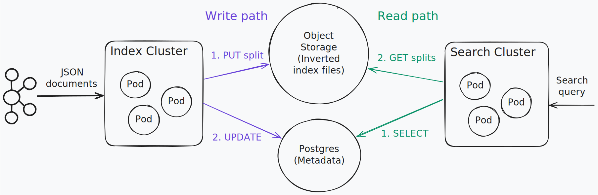

## Introduction

`toshokan-go` is a search engine (think Elasticsearch, Splunk), but storing the data on object storage, most similar to [Quickwit](https://github.com/quickwit-oss/quickwit).

It uses:
* [Bluge](https://github.com/blugelabs/bluge) - for building and searching the inverted index data structure.
* [AWS SDK for Go v2](https://github.com/aws/aws-sdk-go-v2) - for S3-compatible object storage operations.
* [SQLite](https://www.sqlite.org/) - for storing metadata atomically, removing data races.
* [IBM Sarama](https://github.com/IBM/sarama) - for Kafka integration and real-time streaming.

This is a Go implementation inspired by [Toshokan](https://github.com/tontinton/toshokan/) which is written in Rust.

## Architecture

<kbd style="background-color: #1e1e1e">
  
</kbd>

## How to use

```sh
# Start MinIO and Kafka
docker-compose -f docker-compose.kafka.yml up -d

# Create an index
./run_toshokan.sh --db "sqlite:./test.db" create example_config.yaml

# Index a json file delimited by new lines.
./run_toshokan.sh --db "sqlite:./test.db" index test tests/hdfs-logs-multitenants-10000.jsonl

# Index json records from kafka.
# Every --commit-interval, whatever was read from the source is written to a new index file.
./run_toshokan.sh --db "sqlite:./test.db" index test kafka://localhost:9092/topic --stream

./run_toshokan.sh --db "sqlite:./test.db" search test "tenant_id:[60 TO 65} AND severity_text:INFO" --limit 1
# {
#   "score": 8,
#   "document": {
#     "_id": "c3a84c41-f101-42af-8a52-5141d98ef898_0",
#     "attributes": "map[class:datanode]",
#     "body": "HDFS write operation completed successfully",
#     "resource": "map[service:datanode]",
#     "severity_text": "INFO",
#     "tenant_id": "61",
#     "timestamp": "2016-04-13 06:46:54 +0000 UTC"
#   }
# }

# Merge index files for faster searching.
./run_toshokan.sh --db "sqlite:./test.db" merge test

./run_toshokan.sh --db "sqlite:./test.db" drop test
```


## Quick Demo

```sh
# Start environment
docker-compose -f docker-compose.kafka.yml up -d

# Quick test workflow
./run_toshokan.sh --db "sqlite:./demo.db" create example_config.yaml
./run_toshokan.sh --db "sqlite:./demo.db" index test tests/hdfs-logs-multitenants-10000.json
./run_toshokan.sh --db "sqlite:./demo.db" search test "INFO" --limit 3
```

## Database Issues

### Common SQLite Issues

**UNIQUE constraint failed: indexes.name**
```bash
# Solution: Drop existing index or delete database
./run_toshokan.sh --db "sqlite:./test.db" drop test
# OR
rm -f test.db
```

**Database locked or busy**
```bash
# Check if another process is using the database
lsof test.db
# Kill the process or wait for it to finish
```

**Check database contents**
```bash
# List all indexes
sqlite3 test.db "SELECT * FROM indexes;"

# List all index files
sqlite3 test.db "SELECT * FROM index_files;"

# Check database schema
sqlite3 test.db ".schema"
```


